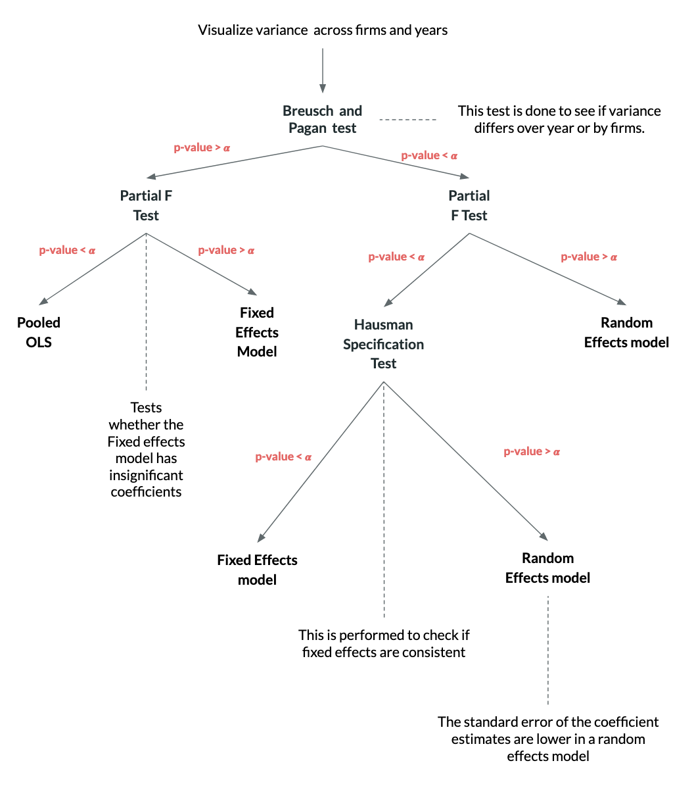

```{r setup, include=FALSE}
knitr::opts_chunk$set(echo = FALSE,warning = FALSE,message = FALSE)
library(tidyverse)
library(readxl)
library(here)

debt <- read_xls(here("Project 3","data-raw","raw_data_1.xls"),
                 sheet = "Debt Data") %>% 
  rename(c("year" = "...2")) %>% 
  select(-`...1`) %>% 
  select(-c(`Ceylon Grain Elevators PLC`:`Lanka Tiles PLC`)) %>% 
  mutate(debt_type = rep(c("TDE","LDE","SDE"),each=10),.before=year) %>% 
  pivot_longer(`Royal Ceramics Lanka PLC`:`Piramal Glass Ceylon PLC`,names_to = "Company",values_to = "Debt")

market <- read_xls(here("Project 3","data-raw","raw_data_1.xls"),sheet = "Macro Economic Factors",range = c("A2:M5")) %>% 
  rename(c("Factor" = `...1`)) %>% 
  select(Factor,`2009`:`2018`) %>% 
  pivot_longer(`2009`:`2018`,
               names_to = "Year",values_to = "Value")
```

# Abstract

The term “panel data” refers to the pooling of observations on a cross-section of households, countries, firms, etc. over several time periods. The models that are associated with panel data examine the group wise and time wise effects which can eitehr be fixed or random. In this document a specification of the workflow and methodology associated with the research project under the title of "Capital Structure And Profitability: Do Macro Economic Factors Matter?" will be presented.

\newpage
\tableofcontents
\newpage

# Environment Setup

The research analysis will be carried out using R as its an open source software capable of performing advanced statistical analysis in a reproducible manner. The R codes that will be used for the final research analysis will be explained as a supplementary material for the reader to understand the steps in the algorithm. 

### R Installation

R is available freely for download through The Comprehensive R Archive Network([CRAN](http://cran.r-project.org/)). Proceed to the link that would best fit your operating system be it Windows, Mac or Linux. 

A step by step procedure is highlighted below for Windows installations.

1. Click on the "**Download R for Windows**" link.
2. Click on the "**base**" link.
3. Click on the "**Download R 4.X.X for Windows**".
4. Run the downloaded program.
5. Click on Next button and step through the wizard.


### RStudio Installation

RStudio is a software that is built to make the development of R scripts and notebooks easier by providing a intergrated development enviornment with a graphical user interface. 

### Supplementary Package Installation

Different algorithms written in R are grouped together in a structure called a package. In R, packages can be installed using the ```install.packages``` R function or by going to the packages tab in RStudio.

The following packages would be helpful to install when running our analysis code.

```{r,echo=TRUE,eval=FALSE}
install.packages("tidyverse")
install.packages("plm")
install.packages("readxl")
```

A short description of the packages are as follows.

1. ```tidyverse```: A suite of packages that build the ecosystem called the tidyverse which enables for efficinet data reading, wrangling and visualization.
2. ```plm```: A package for R which intends to make the estimation of linear panel models straightforward
3. ```readxl```: A package for reading excel files
4. ```rmarkdown```: A package for preparing reproducible reports.

Once the environment has been setup and the final reproducible R notebook is developed, there will be a separate document that explains the specific R commands that were used in the analysis. In the meantime, refer to the [*Hands on Programming with R Book*](https://rstudio-education.github.io/hopr/) for more information on learning the fundamentals of R.

# Workflow

In this analysis a tidy data workflow will be followed as illustrated in the following figure. This workflow will ensure that the analysis will be conducted in a manner that is efficient and straightforward.

\centering


\raggedright

## Importing and Tidying Data

As the first step the importing and tidying of the data is currently underway as the data is being entered into a tidy format. The final dataset would contain the following data from 26 firms for over 10 years. 

* Dependent variable
  * Profitability
* Independent variable 
  * Capital Structure
    * Total Debt to Equity
    * Long Term Debt to Equity
    * Short Term Debt to Equity
* Entity invariant variables
  * Market Capitalization
  * GDP
  * Inflation Rate
* Firm Specific variables
  * Firm Size
  * Tangible Assets

The next components in the process would be to transform and visualize the data.

## Data Visualization

There are several approaches of visualizing the data that is given in a panel data since the data contains a mixture of longitudinal and cross sectional data. One method would be to visualize the measurements of each variable with respect to the firms that are available in the data across time. An example visualization from the given dataset is illustrated below.

```{r,fig.height=8}
debt %>% 
  ggplot(aes(x = year,y = Debt,color = debt_type)) +
  geom_point() + 
  geom_line() + 
  theme_minimal() +
  facet_wrap(~ Company,scale="free_y",ncol = 3) + 
  theme(legend.position = "bottom") +
  labs(title = "Capital Structure of the firm",subtitle = "for all 18 firms",color = "Type of debt")
```

In terms of the macro economic variables which are entity invariant a simple line plot would be helpful to identify any patterns across time. 

```{r}
market %>% 
  ggplot(aes(x = Year,y = Value,group = Factor))+
  geom_point() +
  geom_line() +
  facet_wrap(~ Factor,scales = c("free_y"),nrow = 3) +
  theme_minimal() +
  labs(title = "Macro Economic Control Factors",subtitle = "From 2009 - 2017")
```
In addition to the above it would be beneficial to visualize the variance of each variable across time and entities to identify if there is a clear visible difference, in which case we can verify through the results of the statistical tests that would be performed.

## Modelling Workflow

A panel data regression differs from a regular time-series or cross-section regression in that it has a double subscript on its variables. In general the model can be specified as such,

$$
y_{it} =\alpha + X_{it}^{'}\beta + u_{it}
$$
where $i = 1,\dots,N$,$t = 1,\dots,T$ and with $i$ denoting households, individuals, firms, countries, etc. and $t$ denoting time. The $i$ subscript denotes the cross-section dimension while the $t$ denotes the time-series dimension. $\alpha$ is a scalar, $\beta$ is $K \times 1$ and $X_{it}$ is the $it$th observation on $K$ explanatory variables

In this analysis, 

$$
Y_{it} = \beta_0 + \beta_1LDE_{it} + \beta_2SDE_{it} + \beta_3TDE_{it} + \beta_4SF_{it} + \beta_TA_{it} + \beta_6GDP_{t} + \beta_7INF_{t} + \beta_8MC_{t} + \epsilon_{it}
$$
Here $Y_{it}$ could refer to ROA or ROE depending on the model. The variable names correspond to the variables in the framework. 

* TDE ~ Total Debt to Equity
* LDE ~ Long Term Debt to Equity
* SDE ~ Short Term Debt to Equity
* TA ~ Tangible Assets
* SF ~ Size of the Firm
* MC ~ Market Capitalization 
* GDP ~ Gross Domestic Product
* INF ~ Inflation Rate

The above model can be reformulated in a fixed effects model by introducing a time invariant variable to capture omitted variables.

### The proposed flow diagram



The above illustration depicts the workflow that will be utilized in the analysis. Since panel data contains both cross sectional and longitudinal data the effects of the firm variables and the year on the response variable can be fixed through out time and entities or can be considered a random variable which can take on many states. To decide on which method should be utilized a series of tests would have to be utilized as shown in the flow diagram.

### Terminology

**Fixed Effects**:  The effect of the predictor variables on the response variable is fixed through out firms or years in this model. Fixed effects estimate separate levels with no relationship assumed between the levels.

**Random Effects**: The term random can be misleading as there there is nothing inherently random about random effects. The way to think about random effects is that each level of the effect could be considered a draw from a random variable. In other words, the levels or groups in a random effect can be conceptualized as a sample of levels from a larger population of levels—some of which may not be represented in the model.

**Pooled OLS (Pooled Ordinary Least Squares)**:  All observations across time and firms will be considered together in one regression model with the assumption that the effects are the same for all firms and that the errors are not correlated with the predictor variables. This has the chance of hiding the firm specific and time specific effects on the response variable.

**Partial F Test**: A test that takes in a full model and a reduced model to see which model is better suited for the data. In this analysis this test would be testing whether the fixed effeccts model is better suited for the data than the pooled OLS model.

**Breusch Pagan Test**: This test checks whether the variance of the variables of the firms are equal through out the year. IF they are then a pooled OLS can be conducted after a partial F test.

**Haussman Test**: Put simply this test will help to determine whether a fixed effects model is better suited for the data or a random effects model is better suited for the data. 