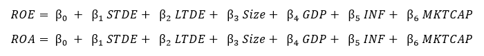
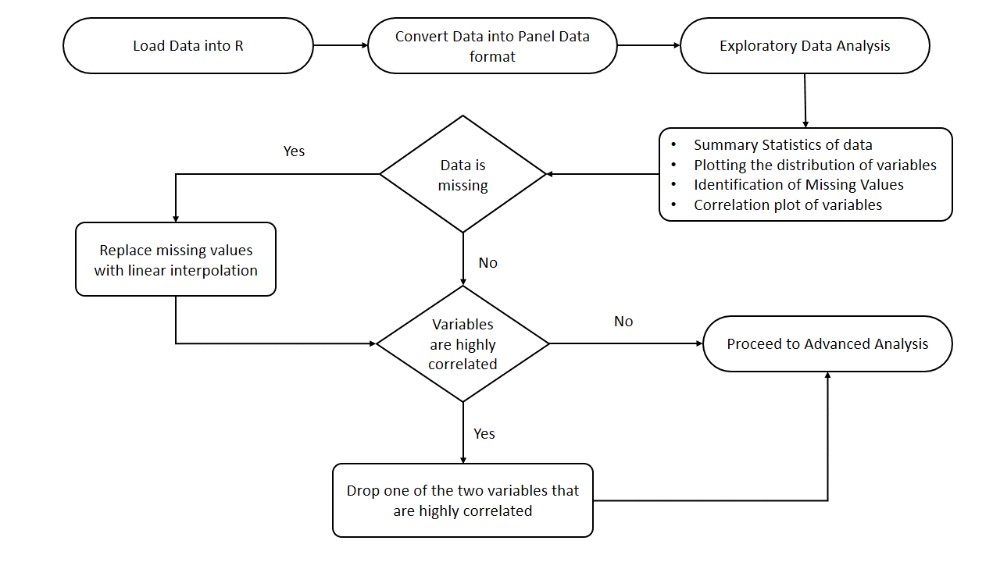
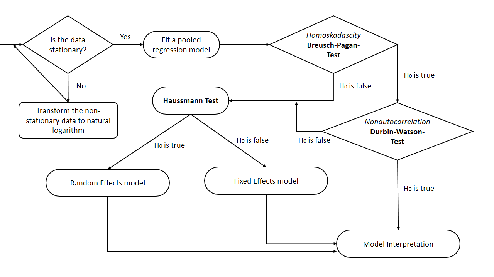

```{r setup, include=FALSE}
setwd("D:/Uni/Year 4/STA 474 2.0 Statistical Consultancy/Client 1/Phase 2")

library(readxl)

#Firm specific data
df<- read_excel("Modified Data Set 10.01.2021.xls")
#Macro-economic variables
df2 <- read_excel("Modified Data Set 10.01.2021.xls", sheet=2)

library(tidyverse)

#Package to deal with panel data
library(plm)
 
#scattter plot
 library(car)
 
 #plot means
 library(gplots)
 
 # linear interpolation te replace missing values
 library(zoo)
 
 #correlation plot
 library(corrplot)
 
 #to create a dataframe for unit root test
 library(plm)
 
 #unit root test
 library(urca)
 
 #Breusch-Pagan-Test
 library(lmtest)
 
 #Durbin Watson test 
 library(car)
```

## Disclosure

This report is a compendium of the data analysis and modelling procedure followed with respect to the research topic *Capital Structure and Profitability: Do Macro Economic Factors Matter?*. The report has been compiled relating to phase 2 of the client engagement of Ms. Samanmali Dassanyake on behalf of the Statistical Consultancy Services, USJ.

## 1. Introduction

Capital structure can be seen as the specific combination of debt and equity used to finance a company's assets and operations. Many theories and views with regards to the optimal combination of debt to equity that will maximize a firm's profitability has been discussed across the years. 

This study is an analytical research design that has been carried out to find evidence of the effect that macroeconomic variables might or might not have on the relationship between capital structure and profitability. 

## 2. Research Objectives

The defined research objectives are as follows;

1. To examine the impact of Growth of Gross Domestic Product (GDP) on the relationship between Capital Structure and Profitability of manufacturing firms listed in Colombo Stock Exchange.

2. To examine the impact of Inflation on the relationship between Capital Structure and Profitability of manufacturing firms listed in Colombo Stock Exchange.

3. To examine the impact of Market Capitalization on the relationship between Capital Structure and Profitability of manufacturing firms listed in Colombo Stock Exchange.

4. To examine the relationship between Capital Structure and Profitability of manufacturing firms listed in Colombo Stock Exchange.

## 3. Data and Variables

The variables of interest has been identified as per the below given conceptual framework.


The Return on Equity (ROE) and Return on Assets (ROA) has been considered as the measure for firm's performance (profitability) and the Debt ratios (Total, Long Term and Short Term) has been considered as the measure of capital structure of a firm. The considered macro-economic variables are Gross Domestic Product (GDP), Inflation and Market capitalization of the Colombo Stock Exchange. Tangible assets and Size of the firm have been considered as firm specific control variables.


Accordingly the variables considered for the study are as follows;

| Dependent Variable | Independent Variables                                                                        | Control Variables  | 
|--------------------|:--------------------------------------------------------------------------------------------:|-------------------:|
| ROE               | Total Debt to Equity, Long term Debt to Equity, Short term Debt to Equity    | Tangible Assets    | 
| ROA                | GDP , Inflation , Market Capitalization                                      | Size of firm       | 


The data has been derived with respect to 31 manufacturing firms listed in Colombo Stock Exchange. The data is available for a period of 10 years from 2011-2020. This data set is a combination of cross sectional data (with respect to the firms) and time series data (with respect to the year) and hence the data set is a panel data set.

## 4. Data Analysis methodology 

Data analysis has been carried out via R programming language. The data analysis process consists of mainly two stages, namely; preliminary analysis and advanced analysis. *Please refer Annexure 1 and Annexure 2 to explore the workflow of the preliminary and advanced analysis.*

Prior to the analysis the data set has been wrangled to obtain the required format to apply panel regression. A preview of the dataset is as shown below.

```{r data wrangling, comment=NA, echo=FALSE}

# Create vector of unique Firm names
Firm <- (df[complete.cases(df$`Company Name`), ])$`Company Name`
# Combine with dataframe
Firm <- rep(Firm, each=7)
df<- cbind(df[, -2] , Firm)

#Correct name of first column
names(df)[1] <- 'Measure'

#Re-arrange columns and rows to required format
df<- df %>% 
          pivot_longer(2:11, names_to = "Year", values_to = "count") %>% 
          pivot_wider(names_from = Measure, values_from = count)


#Include Macro-economic variables to dataframe
GDP <- rep(df2$GDP, times=31)
INF <- rep(df2$INF, times=31)
MKTCAP <- rep(df2$MKTCAP, times=31)

df <- cbind(df, GDP, INF, MKTCAP)
df <- df %>% mutate(Firm = str_replace(Firm," PLC","") %>% str_to_title())

head(df)

# convert your data to a panel data set
paneldf <- plm.data(df, index=c("Firm","Year"))

```


## 5. Preliminary Analysis

The summary statistics of the data is as follows;

```{r summary stat, comment=NA, echo=FALSE}
# Identify columns with missing values

summary(paneldf) 

```

**Missing Values**

As shown below, it can be seen that there the missing value count with respect to each variable is zero. Therfore, no precautions for the treatment of missing values is necessary.

```{r missing values, comment=NA, echo=FALSE}
# Identify columns with missing values

colSums(is.na(paneldf)) 


```

**Correlation**
According to the correlation plot, it can be seen that there is a very high correlation (0.93) between Short term debt to Equity (STDE) and Total Debt to Equity (TDE) and; additionally there is also marginally a positive relationship (0.52) between Long term debt to Equity (LTDE) and Total Debt to Equity (TDE). Considering that the loss of information is minimum given that both long term and short term debt to equity ratios are considered for the model; the variable TDE is removed from the dataset.

Hence the variable TDe is removed from the analysis.

```{r correlation, comment=NA, echo=FALSE}
correlation <- cor(subset(paneldf, select = -c(Year, Firm) ))
corrplot(correlation)
correlation
  
  
```

## 6. Advanced Analysis

Note: For all the hypothesis testing carried out in the study, the decision rule that applies is as follows;
*Reject H0 and accept H1 if p-value < 0.05 where; 0.05 is the considered level of significance and H0 is the null hypothesis and H1 is the alternate hypothesis*

**Stationarity: Unit Root test**

The stationarity of the considered variables can be tested via the **Unit Root test**

The considered null and alternate hypothesis are as follows;

H0 : The series is not stationary

H1 : The series is stationary 

The results of the test is as follows:

| Variable | p-value       | Conclusion                               |
| -------- |:-------------:| -----:                                   |
| ROE      | < 2.2e-16     | Reject H0 at 5% level of significance    |
| ROA      | 2.16e-15      | Reject H0 at 5% level of significance    |

Therefore, it can be seen that both the response variables are stationary. 

```{r stationarity,include=FALSE}

# create required data format
pdata <- pdata.frame(paneldf, index = c("Firm", "Year"))
# test for stationarity
purtest(ROE ~ 0, data = pdata, lags = "AIC" , pmax = 2, test = "madwu")
purtest(ROA ~ 0, data = pdata, lags = "AIC" , pmax = 2, test = "madwu")

```

**Pooled Regression model**

The pooled OLS regression model is initially fitted and the model assumptions are further validated to ensure the accurate model is fitted.

Accordingly the following modela are fitted with respect to ROE and ROA;



```{r pooled OLS, include = FALSE}
#Pooled regression
ols <-lm(ROE ~ STDE + LTDE + Size + GDP + INF + MKTCAP, data = paneldf)
ols2 <-lm(ROA ~ STDE + LTDE + Size + GDP + INF + MKTCAP, data = paneldf)

# test for Homoskedasticity 
bptest(ols)
bptest(ols2)

#test for autocorrelation
durbinWatsonTest (ols)
durbinWatsonTest (ols2)

```

The model assumptions and the corresponding statistical tests are as follows;

*1. Homoskedasticity - Breusch-Pagan-Test*

H0 : Variances are equal

H1: Variances are not equal

|Response Variable | p-value       | Conclusion                               |
| -------- |:-------------:| -----:                                   |
| ROE      | 0.06254     | Do not reject H0 at 5% level of significance    |
| ROA      | 0.4304      | Do not reject H0 at 5% level of significance    |

Therefore, it can be seen that the assumption of constant variance is valid for both the models. 

hence irrespective of the autocorrelation test a fixed or random effects model should be fitted.

*2. Non-autocorrelation - Durbin-Watson-Test* 

H0 : OLS regression residuals are not auto-correlated

H1 : OLS regression residuals are auto-correlated

|Response Variable | p-value       | Conclusion                               |
| -------- |:-------------:| -----:                                   |
| ROE      | 0    | Reject H0 at 5% level of significance    |
| ROA      | 0      | Reject H0 at 5% level of significance    |

Therefore, it can be seen that there is auto-correlation within both the models. Hence despite having constant variance, a fixed or random effects model should be fitted.

**Choosing between fixed and random effects model**

The **Haussmann Test** can be used to choose between the Random and Fixed effects model as follows

H0 : Preferred model is Random effects model 
H1: Preferred model is fixed effects model

Whereby; if H0 is rejected, fixed effects model is selected otherwise a random effects model is selected.

|Response Variable | p-value       | Conclusion                               |
| -------- |:-------------:| -----:                                   |
| ROE      | 0.9065    | Do not reject H0 at 5% level of significance    |
| ROA      | 0.6582      |Do not reject H0 at 5% level of significance    |

Therefore, it can be concluded that a Random effects model is the best fit.

```{r, include = FALSE}

#Hausmann test
form1 <- ROE ~ STDE + LTDE + Size + GDP + INF + MKTCAP
form2 <- ROA ~ STDE + LTDE + Size + GDP + INF + MKTCAP

phtest(form1, data = paneldf)
phtest(form2, data = paneldf)

# Random effect
random <- plm(ROE ~ STDE + LTDE + Size + GDP + INF + MKTCAP, data=paneldf, model="random")
random2 <- plm(ROA ~ STDE + LTDE + Size + GDP + INF + MKTCAP, data=paneldf, model="random")

```

**Random Effects model**

The summary results of the model fitted with respect to ROE is as follows;

```{r, comment=NA, echo=FALSE}
summary(random)

```

It can be seen that the variables STDE and Size are statistically significant within the model.

The summary results of the model fitted with respect to ROA is as follows;

```{r, comment=NA, echo=FALSE}
summary(random2)

```

It can be seen that only the variable STDE is statistically significant within the model.

## 7. Model Interpretation & Conclusions

It can be seen that when modeled with respect to ROE, the performance of manufacturing firms depends on the short term debt to equity ratio and Size of the Firm. When modeled with respect to ROA, the performance of manufacturing firms depends only on the short term debt to equity ratio. Conclusively, it can be said that Short term debt ratio has a statistically significant effect on the performance of the Firm.

*Limitations of the study*

The Coefficient of determination of both the models are very low despite the validation of the model assumptions. This can be due to lack of data as well as not condiering proper explanatory variables. Therefore, in future studies the possibility of other variables apart from the above used variables to model firm performance can be explored.


## Annexure 1 : Workflow of Preliminary analysis



## Annexure 2 : Workflow of Advanced analysis




