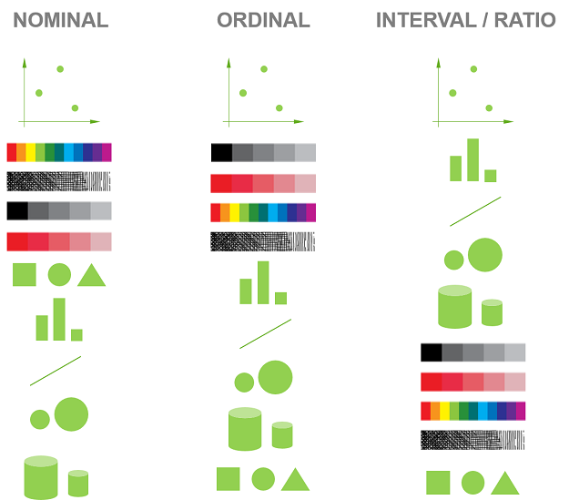

```{r xaringan-themer, include=FALSE, warning=FALSE}
library(xaringanthemer)
style_duo_accent(
  primary_color = "#081d58",
  secondary_color = "#FF961C",
 inverse_header_color = "#FFFFFF",
 title_slide_text_color = "#edf8b1",
 link_color =  "#41b6c4"
)
#style_solarized_light(text_font_google   = google_font("Josefin Sans", "400", "400i", "800i", "800"))
#style_mono_light(
#  base_color = "#1c5253",
#  header_font_google = google_font("Josefin Sans"),
#  text_font_google   = google_font("Josefin Sans", "400", "400i", "800i", "800"),
#  code_font_google   = google_font("Fira Mono")
#)
```

<style>

.center2 {
  margin: 0;
  position: absolute;
  top: 50%;
  left: 50%;
  -ms-transform: translate(-50%, -50%);
  transform: translate(-50%, -50%);
}

</style>

<style type="text/css">
.remark-slide-content {
    font-size: 30px;
}
</style>


## Statistical Consultancy Service at USJ

Goals:

- To provide statistical consulting  to the university researchers and industrial organizations


- To provide an opportunity for BSc (Honours) Statistics undergraduates  to train as statistical consultants 

---

## At the successful completion of this unit, you will learn

- how statistics are applied in the real world

- how to work on multiple problems

- how to work under time constraints

- how to communicate with non statisticians


---

.center2[
```{r, fig.pos="center", echo=FALSE}

```
]


> "The best thing about being a statistician is that you get to play in everyone's backyard."

>John W. Tukey

---

# What does statistical consultant do?

.bold[.orange[Provide statistical advice, analysis and training]]

--
  - Providing assistance for study design, data collection, experimental design
  
--
    
  - Guiding in determining required sample size for valid results
  
--
    
  - Assisting with selecting an software package for data analysis
  
--
    
  - Working with client to select and conduct statistical analysis
  
--
    
  - Coaching clients with the interpretation, writing-up and explaining of results

---

# Responsibilities

- Understand the research question

- Help the client define his or her problem

- Translate research questions into problems that can be analysed with data

- Determine the appropriate type of statistical analysis

- Translate findings back to the clients (interpret data)

- **Keep records of what you do**


---
## Skills

- Communication skills

    - to be able to talk to clients
    
    - understand their language (technical terms, etc)
    
    - communicate statistics effectively
    
    - ability to ask questions
    
    - ability to listen


- Time-management skills/ Meet deadlines

- Networking talents

- Work on multiple projects

---

### Factors that make the consulting process complicated

- difficulty in establishing the client's wants and needs

- training and experience of the consultant

- individual style of the consultant

- most problems do not have a unique solution

- knowledge of the client

- resources available to client and consultant

- the state of the problem (no design, data collected, etc.). 

Source:https://iase-web.org/documents/papers/icots3/BOOK2/B8-4.pdf?1402524953
---

# Difficulties faced by the consultants

.red[Not all projects have gone as smoothly or been as productive.]

- Clients want to run an inappropriate statistical methods

- Clients may seek statistical help after data collection, and data do not support to answer the research question

- Working with clients who think they know statistics

- Dealing with clients "who only want an answer"

- Dealing with impatient clients

- Being constrained by lack of time or other resources

---
## Challenges

- Working on multiple projects

- Working with large messy datasets

- Keeping up with new techniques

---

.bold[.green["These problems are common and that every statistical consultant, anywhere in the world, has dealt with one or more of the same struggles."]]

.green[Source: Why Be a Statistical Consultant?, STATtr@k, ASA]

---

# Asking Good Questions


> "Better a poor answer to the right question than a good answer to the wrong question."

> John W Tukey

- We want to answer the client's question. Hence, we must ask right questions to get all necessary information  without intimidating or insulting the client.

---

# Asking Good Questions


- Plan **What information do we need?**

- Welcome the client and made them feel comfortable

- Ask questions to get necessary information
        
    - Listen carefully
        
    - Slow down
    
    - Clarify all terms
    
    - Ask if you do not understand
    
    - Take notes, if needed
    
---

# Common questions

.pull-left[

- Research area/ domain

- Goals and objectives

- Motivation

- Significance of the study

- Novelty of the study topic

- Related work (literature, relevant methods, etc)


]

.pull-right[

- Data collection procedure

- Sample size

- Structure of data

- Missing values, outliers

- Limitations of data

- Was design followed


]
    
---

# Common questions

.pull-left[

- Sample survey:  target population, variables, sampling design, sampling frame, sources of bias, sampling unit

- Design of experiments: experimental unit, sampling unit, factors,  treatments, responses, randomization, blocking, design


]

.pull-right[

-  Background reading?
]
---
class: duke-softblue, middle, center

# Question types

---

# Close probe questions (usually with Yes  or No)

- Did you interview every person on the list?

- Are there any missing values?

---

# Open probes (long responses)

- What factors are likely to affect the response?

- I’d like to hear more about the independent variables you  plan to measure.

- Is there anything more that we should discuss related to food packaging types before we go on to discuss the variables
you plan to measure?

---

# Ask if you don’t understand

Restate factual information and make sure you have gotten everything correct.

- Let me make sure that I understand ...

- Do I have this correctly?

- So a sampling unit is an individual person, is that correct?


---

# Solutions


- Learn about your client’s field

- Learn about statistical methods commonly used  in the field


- Learn the common problems in the field

---

# Common requests

- Experimental/survey design and planning

- Sample size determination

- Data entry

- Data wrangling

- Data visualization

- Data analysis

- Statistical inference

- Interpretation of results

- Statistical software 


---

# Benefits of doing statistical consultancy

- Great way to keep learning and honing  your statistical craft

- Learn to communicate with non-statisticians.

- Learn to formulate the statistical aspects of other researcher's problems.

- Expand your professional network

- Fabulous career choice

---
class: middle, center

# So go! Consult! Have fun!


---
# Tools

- Git and GitHub

- Dashboard

- Parametrized reports

- `here` package

---

# Workflow in R

**main.R**

a list of source statements to run each of the other R files in order

**functions.R**

functions you need for analysis

**xxx.R**

- 1_load.R
- 2_data.R
- 3_clear.R
- 4_do.R


---
background-image: url(img/wf/w1.png)
background-size: cover


---
background-image: url(img/wf/w2.png)
background-size: cover

---
background-image: url(img/wf/w3.png)
background-size: cover

---
background-image: url(img/wf/w4.png)
background-size: cover


---

## Data Visualization

- Data

- Data cleaning

- Visualize

- Explained with a story

---

## Rproj

- data-raw folder

- data

- script file

- .Rmd file

---

## Cognitive Principles

Less conginitive effort to read the chart (what is presented) and save the time to think about the content of the chart

- Good visualizations take advantage of the human visual system's ability to process information with little effort.

## Preattentive graph perception

It requires no conscious effort from the viewer to do understand what is presented through the design. It's automated and takes between 200-500 milliseconds to complete in the spatial memory.

(**Spatial** working **memory** entails the ability to keep spatial information active in working memory over a short period of time.)

---

class: inverse, center, middle

## Cognitive principles

---
## 1. Proximity

.pull-left[

```{r, comment=NA, echo=FALSE, message=FALSE, warning=FALSE}
library(palmerpenguins)
library(tidyverse)
data(penguins)
penguins[complete.cases(penguins),] %>%
  count(species, sex) %>%
  ggplot(aes(x=sex, y=n, fill=sex)) + 
  geom_bar(stat="identity") + 
  facet_grid(~species) +   scale_fill_manual(values = c("#FB7BBE","#6096FD"))

```
]

.pull-right[

```{r, comment=NA, echo=FALSE, message=FALSE, warning=FALSE}
library(palmerpenguins)
library(tidyverse)
data(penguins)
penguins[complete.cases(penguins),] %>%
  count(species, sex) %>%
  ggplot(aes(x=species, y=n, fill=species)) + 
  geom_bar(stat="identity") + 
  facet_grid(~sex) +   scale_fill_manual(values = c("darkorange","purple","cyan4"))

```

]

---

# 2. Similarity


.pull-left[

```{r, comment=NA, echo=FALSE, message=FALSE, warning=FALSE}
library(palmerpenguins)
library(tidyverse)
data(penguins)
penguins[complete.cases(penguins),] %>%
  count(species, sex) %>%
  ggplot(aes(x=sex, y=n, fill=sex)) + 
  geom_bar(stat="identity") + 
  facet_grid(~species) +   scale_fill_manual(values = c("#FB7BBE","#6096FD"))

```
]

.pull-right[

```{r, comment=NA, echo=FALSE, message=FALSE, warning=FALSE}
library(palmerpenguins)
library(tidyverse)
data(penguins)
penguins[complete.cases(penguins),] %>%
  count(species, sex) %>%
  ggplot(aes(x=species, y=n, fill=species)) + 
  geom_bar(stat="identity") + 
  facet_grid(~sex) +   scale_fill_manual(values = c("darkorange","purple","cyan4"))

```

]

---

## 3. Common region

.pull-left[
```{r, comment=NA, echo=F, warning=FALSE}
ggplot(penguins) + geom_point(aes(x=bill_length_mm, y=bill_depth_mm, color=species)) + scale_color_manual(values = c("darkorange","purple","cyan4"))

```

]

.pull-right[
```{r, comment=NA, echo=F, warning=FALSE}
ggplot(penguins) + geom_point(aes(x=bill_length_mm, y=bill_depth_mm, color=species)) + stat_ellipse(aes(x=bill_length_mm, y=bill_depth_mm, color=species, fill=species), geom="polygon", alpha=0.2)+ scale_color_manual(values = c("darkorange","purple","cyan4")) + 
  scale_fill_manual(values = c("darkorange","purple","cyan4")) 

```

]

---

## 4. Common fate

.pull-left[

```{r, warning=FALSE, comment=NA, message=FALSE, echo=FALSE}

library(coronavirus)
coronavirus %>% filter(country=="US" | country== "India") %>% filter(type=="confirmed") %>%  ggplot() + geom_line(aes(x=date, y=cases, color=country))

```


]

--
.pull-right[

```{r, warning=FALSE, comment=NA, message=FALSE, echo=FALSE}
US <- coronavirus %>% filter(country=="US" | country== "India") %>% filter(type=="confirmed") %>% group_by(country, date) %>%
  summarise(cases = sum(cases)) %>% filter(country=="US")
India <- coronavirus %>% filter(country=="US" | country== "India") %>% filter(type=="confirmed") %>% group_by(country, date) %>%
  summarise(cases = sum(cases)) %>% filter(country=="India")
df <- data.frame(India=India$cases, US=US$cases)
ggplot(df, aes(x=US, y=India)) + geom_point()

```


]

---


.pull-left[

US vs India

```{r, warning=FALSE, comment=NA, message=FALSE, echo=FALSE}

library(coronavirus)
coronavirus %>% filter(country=="US" | country== "India") %>% filter(type=="confirmed") %>%  ggplot() + geom_line(aes(x=date, y=cases, color=country))

```


]

.pull-right[

US vs Russia

```{r, warning=FALSE, comment=NA, message=FALSE, echo=FALSE}
coronavirus %>% filter(country=="US" | country== "Russia") %>% filter(type=="confirmed") %>%  ggplot() + geom_line(aes(x=date, y=cases, color=country))

```

]

---


.pull-left[

US vs India

```{r, warning=FALSE, comment=NA, message=FALSE, echo=FALSE}

US <- coronavirus %>% filter(country=="US" | country== "India") %>% filter(type=="confirmed") %>% group_by(country, date) %>%
  summarise(cases = sum(cases)) %>% filter(country=="US")
India <- coronavirus %>% filter(country=="US" | country== "India") %>% filter(type=="confirmed") %>% group_by(country, date) %>%
  summarise(cases = sum(cases)) %>% filter(country=="India")
df <- data.frame(India=India$cases, US=US$cases)
ggplot(df, aes(x=US, y=India)) + geom_point()


```


]

.pull-right[

US vs Russia

```{r, warning=FALSE, comment=NA, message=FALSE, echo=FALSE}
US<- coronavirus %>% filter(country=="US" | country== "India") %>% filter(type=="confirmed") %>% group_by(country, date) %>%
  summarise(cases = sum(cases)) %>% filter(country=="US")
Russia <- coronavirus %>% filter(country=="Russia" | country== "India") %>% filter(type=="confirmed") %>% group_by(country, date) %>%
  summarise(cases = sum(cases)) %>% filter(country=="Russia")
df <- data.frame(US=US$cases, Russia=Russia$cases)
ggplot(df, aes(x=US, y=Russia)) + geom_point()

```

]

---

## 5. Working memory

More than seven categories decrease readability and increase comprehension time. 

---


## 7. Easy comparisons: Example

colour, discriminable shape, indiscriminable shape


```{r, comment=NA, message=FALSE, warning=FALSE, fig.width=20, echo=FALSE}
p1 <- ggplot(penguins) + geom_point(aes(x=bill_length_mm, y=bill_depth_mm, color=species)) + scale_color_manual(values = c("darkorange","purple","cyan4"))
p2 <- ggplot(penguins) + geom_point(aes(x=bill_length_mm, y=bill_depth_mm, shape=species)) + scale_shape_manual(values=LETTERS[c(1, 3, 12)]) 
p3 <- ggplot(penguins) + geom_point(aes(x=bill_length_mm, y=bill_depth_mm, shape=species)) + scale_shape_manual(values=LETTERS[c(5, 6, 12)]) 
library(patchwork)
p1|p2|p3
```


---

## 6. Easy comparisons: Example

.pull-left[

```{r, comment=NA, echo=FALSE, message=FALSE, warning=FALSE}
library(palmerpenguins)
penguins[complete.cases(penguins),] %>%
  count(species, sex) %>%
  ggplot(aes(x=sex, y=n, fill=sex)) + 
  geom_bar(stat="identity") + 
  facet_grid(~species) +   scale_fill_manual(values = c("#FB7BBE","#6096FD"))

```

]

.pull-right[

```{r, comment=NA, echo=FALSE, message=FALSE, warning=FALSE}
p1 <- penguins[complete.cases(penguins),] %>%
  count(species, sex) %>%
  group_by(species) %>%
    mutate(per =  100 *n/sum(n)) %>%
  ggplot(aes(x="", y=n, fill=sex)) + 
  geom_col(stat="identity") + 
  coord_polar("y") + 
   theme(axis.text = element_blank(),
        axis.ticks = element_blank(),
        panel.grid  = element_blank()) +
  facet_grid(~species) +   scale_fill_manual(values = c("#FB7BBE","#6096FD")) + ggtitle("count")

p2 <- penguins[complete.cases(penguins),] %>%
  count(species, sex) %>%
  group_by(species) %>%
    mutate(per =  100 *n/sum(n)) %>%
  ggplot(aes(x="", y=per, fill=sex)) + 
  geom_col(stat="identity") + 
  coord_polar("y") + 
   theme(axis.text = element_blank(),
        axis.ticks = element_blank(),
        panel.grid  = element_blank()) +
  facet_grid(~species) +   scale_fill_manual(values = c("#FB7BBE","#6096FD")) + ggtitle("percentage")

p1/p2

```

---

## Which visual encoding method is best for you?


.pull-left[

]

.pull-right[

Source: https://www.qlik.com/blog/visual-encoding

]


